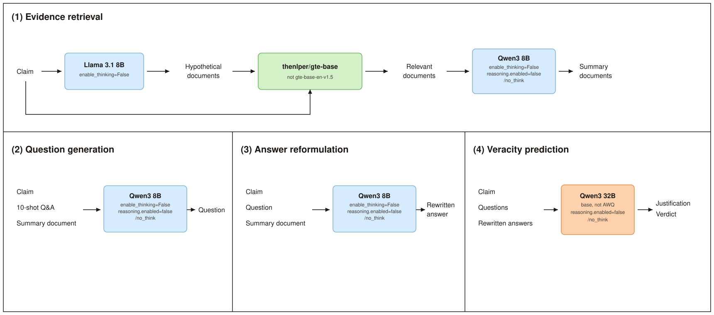

# HerO2 on a Mac, via OpenRouter

This note describes the pipeline actually run in this checkout. It is a connectivity reproduction of [HerO 2](README.md) for one AVeriTeC dev claim. It is not a faithful rerun of the paper.

Hardware was a MacBook Pro (M4 Pro, 24 GB, no NVIDIA GPU). vLLM and the local Qwen3-32B weights do not run here, so every generation call goes through OpenRouter. The API key lives in `.env` as `OPENROUTER_API_KEY` and is not committed.

## Pipeline we ran



Same four blocks as the HerO 2 method figure. The lines under each model name are the parameters actually set in code.

The paper's figure uses `gte-base-en-v1.5` for embeddings and fine-tuned `Qwen3 AWQ 32B` for the verdict. Those two boxes are the ones this run changed.

## Models we actually called


| Stage                  | Script still asks for              | OpenRouter model                                    | Same as HerO2?                                                      |
| ---------------------- | ---------------------------------- | --------------------------------------------------- | ------------------------------------------------------------------- |
| Hypothetical documents | `meta-llama/Llama-3.1-8B-Instruct` | `meta-llama/llama-3.1-8b-instruct` on DeepInfra     | Yes, same base model                                                |
| Embeddings             | `Alibaba-NLP/gte-base-en-v1.5`     | `thenlper/gte-base` on DeepInfra                    | No. 768-d, 512-token model. Each text is cut to 2000 characters     |
| Document summary       | `Qwen/Qwen3-8B`                    | `qwen/qwen3-8b` (Alibaba only, provider not pinned) | Same base model. Only 307 of 654 pages were summarized              |
| Question generation    | `Qwen/Qwen3-8B`                    | `qwen/qwen3-8b`                                     | Yes                                                                 |
| Answer reformulation   | `Qwen/Qwen3-8B`                    | `qwen/qwen3-8b`                                     | Yes                                                                 |
| Verdict                | `qwen3:32b`                        | `qwen/qwen3-32b` on `deepinfra/fp8` only            | No. This is the base 32B model, not `humane-lab/Qwen3-32B-AWQ-HerO` |


`qwen/qwen3.8-27b:free` was tried and is not part of the run. OpenRouter returned 404: that free route is closed.

Routing is in `hero2/ollama_backend.py`. Chat endpoint: `https://openrouter.ai/api/v1/chat/completions`. Embedding endpoint: `https://openrouter.ai/api/v1/embeddings`.

## Non-thinking

Qwen3 will put the answer in a reasoning field and leave `content` empty unless thinking is turned off. For every Qwen route the client does both of the following:

- `reasoning.enabled = false`
- append `\n/no_think` to the user message

Llama 3.1 does not get `/no_think`.

The original prompts already request `enable_thinking=False` where the script supports it:

- Summary, questions, and answers use `apply_chat_template(..., add_generation_prompt=True, enable_thinking=False)`.
- HyDE adds the suffix `Passage:` . Questions add `Question:` . Answers add `Answer:` .
- The verdict script does not pass `enable_thinking` and does not pass `add_generation_prompt`. The `/no_think` suffix above is still applied, because this route is a Qwen model.


## Sampling kept from the original scripts


| Stage     | Settings                                                                                                                                      |
| --------- | --------------------------------------------------------------------------------------------------------------------------------------------- |
| Summary   | temperature 0.7, top_p 0.8, top_k 20, min_p 0, max_tokens 4096, input truncated at 24000 tokens                                               |
| HyDE      | n=8, temperature 0.7, top_p 1.0, max_tokens 512, stop at three newlines                                                                       |
| Questions | temperature 0.7, top_p 0.8, top_k 20, max_tokens 512, 10-shot BM25 from `train.json`                                                          |
| Answers   | temperature 0.7, top_p 0.8, top_k 20, max_tokens 512. An answer of `none` is dropped                                                          |
| Verdict   | temperature 0.9, top_p 0.7, top_k 1, max_tokens 512, input truncated at 3584 tokens. Up to 3 retries with top_k 2, then `Not Enough Evidence` |


Retrieval is cosine similarity on the mean of the claim embedding and the eight hypothetical-document embeddings. Top 10.

## What the one-claim run actually did

Claim 0: "In a letter to Steve Jobs, Sean Connery refused to appear in an apple commercial." Gold label: Refuted. Predicted label: Refuted.

The 654 page vectors are in `knowledge_store/dev_embed/0.pkl`. Real Qwen summaries are the 307 lines in `knowledge_store/dev_summary/0.json`. The other 347 lines were not generated. For the connectivity run they were replaced with the first 800 characters of the page text and written to `knowledge_store/dev_summary_smoke/0.json`. Retrieval for that run read the smoke file, so some evidence is raw text rather than a model summary.

Outputs:

- `data_store/hero2/smoke1_hyde_fc.json`
- `data_store/hero2/smoke1_retrieval_top_k.json`
- `data_store/hero2/smoke1_top_k_qa.json`
- `data_store/hero2/smoke1_top_k_qa_rewrite.json`
- `data_store/hero2/smoke1_veracity_prediction.json`

`veracity_prediction.py` now accepts either a JSON list or a single JSON object. A one-claim JSONL file is valid JSON, and the old loader treated that object as a dict and crashed.

## Commands for that claim

```bash
# retrieval. Document vectors must already exist.
python hero2/retrieval.py \
  --target_data data_store/hero2/smoke1_hyde_fc.json \
  --embedding_store_dir knowledge_store/dev_embed \
  --knowledge_store_dir knowledge_store/dev_summary_smoke \
  --json_output data_store/hero2/smoke1_retrieval_top_k.json \
  --model Alibaba-NLP/gte-base-en-v1.5 --top_k 10

python hero2/question_generation.py \
  --reference_corpus data_store/averitec/train.json \
  --top_k_target_knowledge data_store/hero2/smoke1_retrieval_top_k.json \
  --output_questions data_store/hero2/smoke1_top_k_qa.json \
  --model Qwen/Qwen3-8B --top_k 10 --end 1

python hero2/answer_rewriting.py \
  --target_data data_store/hero2/smoke1_top_k_qa.json \
  --json_output data_store/hero2/smoke1_top_k_qa_rewrite.json \
  --model Qwen/Qwen3-8B

python hero2/veracity_prediction.py \
  --target_data data_store/hero2/smoke1_top_k_qa_rewrite.json \
  --output_file data_store/hero2/smoke1_veracity_prediction.json \
  --model qwen3:32b
```

The name passed to `--model` stays the official name. `ollama_backend.py` swaps in the OpenRouter model from the table above.